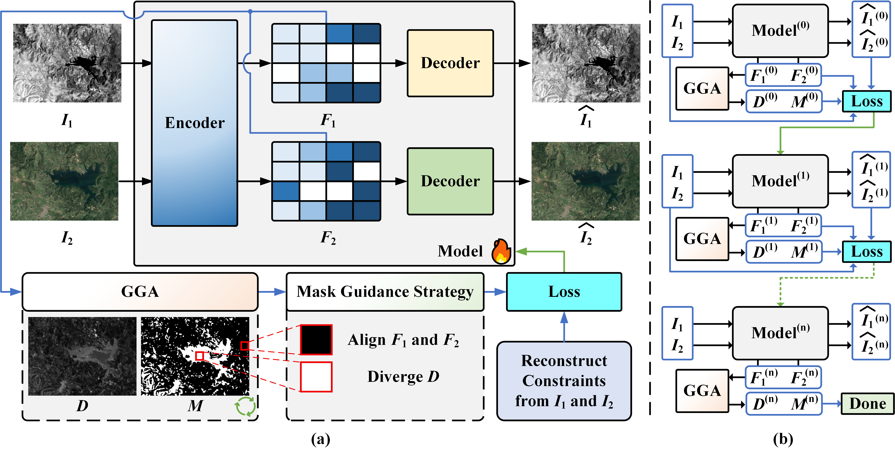

    <h2>
        Unsupervised Change Detection of Heterogeneous Remote Sensing Images via Dynamic Mask-guided Reconstruction
    </h2>

 

  

## Abstract
Unsupervised change detection (CD) in heterogeneous remote sensing images is intrinsically difficult due to severe sensor-specific discrepancies. In the absence of ground truth, these discrepancies result in ambiguous optimization objectives that make it difficult for models to distinguish true land-cover changes from modality-driven pseudo-changes. To address these challenges, we propose MaskUCD, a novel unsupervised framework that analyzes change based on latent features, and is driven by a progressive mask-guided refinement strategy. Unlike conventional methods relying on static constraints or passive alignment strategies, MaskUCD establishes an active, reconstruction-driven feedback loop. This mechanism dynamically generates a guidance mask to enforce feature alignment in mask-unchanged regions and divergence in mask-changed regions, which iteratively decouples real changes from modality differences. To support this iterative optimization, we design a specialized asymmetric autoencoder with a hybrid encoder architecture. By integrating multi-scale frequency analysis and global context modeling, this design creates a functional bottleneck that forces the network to filter out modality-specific noise while preserving semantic integrity. Consequently, the progressively refined mask provides increasingly cleaner supervision, yielding a converged and interpretable difference map derived from the optimized feature discrepancies, from which the final high-quality change map is obtained. Extensive experiments demonstrate that MaskUCD achieves state-of-the-art performance and superior robustness.

## Note
The source code will be made publicly available after the paper is accepted.
